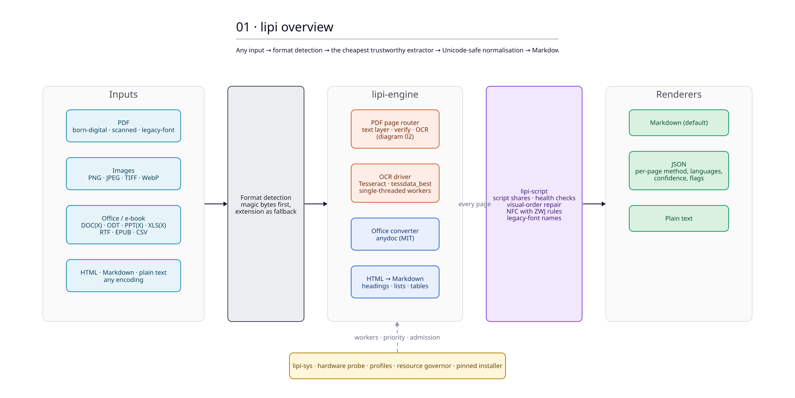
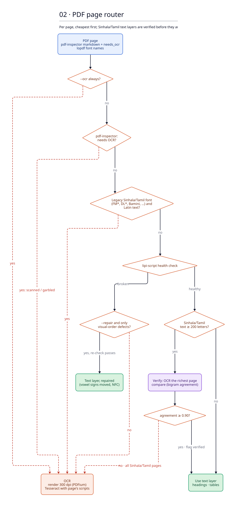
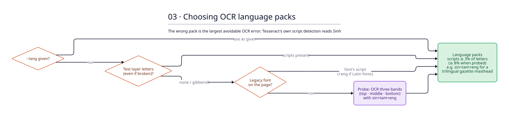
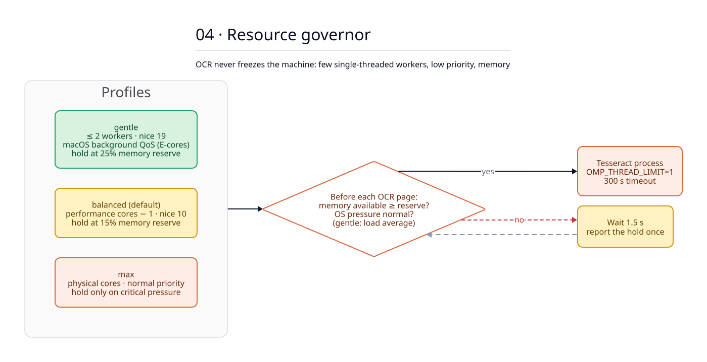
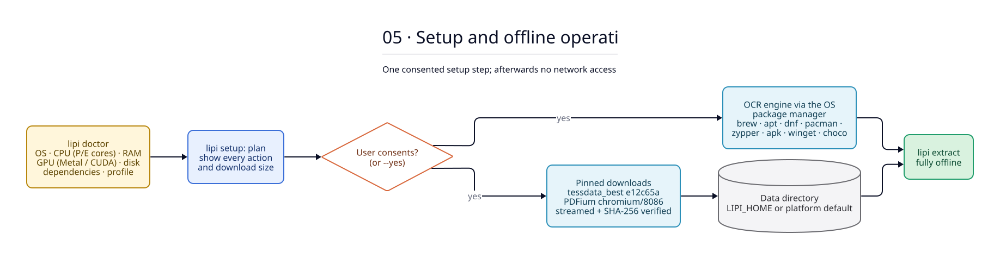
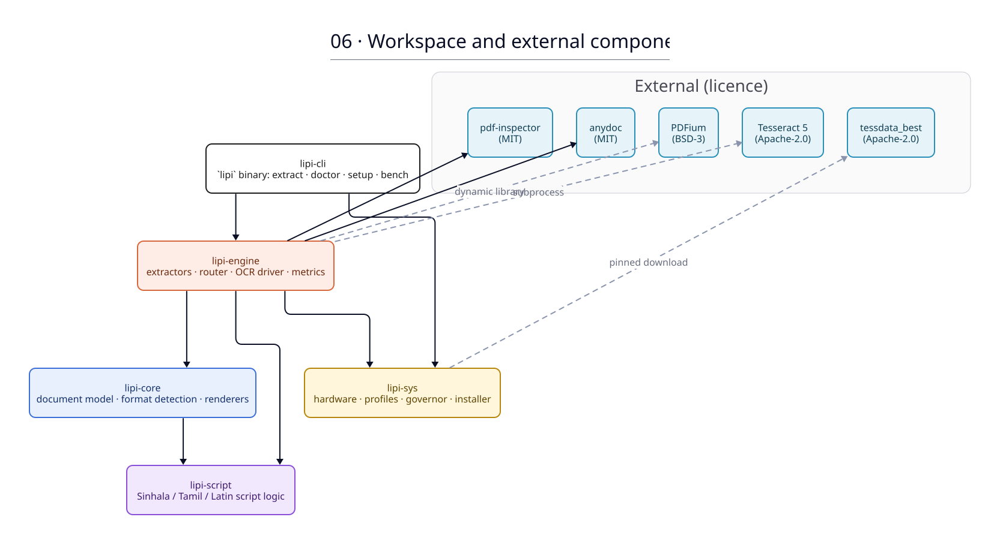

# Architecture

Diagrams are written in [D2](https://d2lang.com) in `src/` and share one palette (`src/_theme.d2`). Regenerate the SVGs with `docs/architecture/render.sh`.

## 01 · Overview
Every input goes through format detection, then the cheapest extractor that can be trusted. Every page then gets Unicode-safe normalisation and is rendered to Markdown (the default), JSON or plain text.

## 02 · PDF page router
lipi decides per page. The text layer from pdf-inspector is used only when it passes four checks:
- pdf-inspector's own reliability check;
- the legacy-font check (FM Abhaya, DL Manel, Bamini, …);
- lipi's script health checks (Latin gibberish, visual-order vowel signs, foreign code points, replacement characters);
- for Sinhala and Tamil, verification against OCR of a sample page.

A page typed in a legacy font lipi has a table for (FM Abhaya and its bold face FM Ababld) is converted
instead of rejected: PDFium reports the font of every glyph, so only the words drawn with the legacy
font are converted and the Latin numbers, dates and references set in Times or Calibri stay as they
are. The converted page must pass the same health checks and, for Sinhala, the same OCR verification
(at a lower agreement threshold, because here the OCR side carries the errors). `--no-legacy-convert`
restores the old behaviour. Every other page is rendered with PDFium and OCRed.

### Legacy-font conversion

The FM Abhaya table in `lipi-script` was derived from the corpus rather than copied: text-layer words
(the font's codes) were paired with OCR words of the rendered page by bounding box, and an alignment
model learned which code sequences produce which Unicode sequences; the result was reviewed by
reading the paired words (`bench/legacy/README.md`). The converter does longest-match replacement,
then moves pre-base vowel signs after their consonant cluster and vowel signs typed before a
rakaransaya after the conjunct, then normalises (NFC composes the two-part vowels ො ෝ ේ ෞ).
On held-out gazette pages it takes about 0.3 s per page where OCR takes 3–4 s, and the two agree at a
word F1 of 0.88 with the differences mostly on the OCR side (`bench/README.md`).

### Why Sinhala and Tamil text layers are not trusted

Government PDFs from Sri Lanka rarely carry correct Sinhala or Tamil text. lipi was tested on documents from documents.gov.lk and parliament.lk, and every Sinhala and Tamil sample needed OCR. The failure modes were:

| Failure | Example in the text layer | Correct text | Detected by |
|---|---|---|---|
| Legacy font (glyphs at Latin code points) | `Y%S ,xld m%cd;dka;%sl` | ශ්‍රී ලංකා ප්‍රජාතාන්ත්‍රික | font name; Latin gibberish score (converted when a table exists) |
| Vowel signs stored in visual order | `පළාෙත්`, `இலங்ைக` | පළාතේ, இலங்கை | visual-order ratio |
| Glyphs mapped to unrelated code points | `ேசாசᾢசக்` | சோசலிசக் | foreign code points; pdf-inspector |
| Lost conjuncts (word stays well formed) | `ශී ලංකා පජාතාන්තික` | ශ්‍රී ලංකා ප්‍රජාතාන්ත්‍රික | verification against OCR |
| Type 3 fonts without mappings | (empty or garbage) | n/a | pdf-inspector |

Even a PDF written by a modern library from correct Unicode text (PyMuPDF with Noto Sans Sinhala) produced a garbled text layer. OCR of the same page reached 0.54% CER.

## 03 · Choosing OCR language packs
Tesseract's orientation-and-script detection labels Sinhala as Latin. lipi therefore picks language packs from, in order:
1. the user's `--lang`;
2. the scripts present in the text layer, which a broken mapping still keeps;
3. the legacy font's script;
4. a probe that recognises three bands of the page with all packs.

## 04 · Resource governor
OCR runs as separate single-threaded processes at reduced priority. Before each page starts, the governor checks available memory and the operating system's memory pressure. When the machine is busy, lipi waits instead of competing.

## 05 · Setup and offline operation
`lipi doctor` reports what the machine offers. `lipi setup` shows its plan and asks for consent. It installs the OCR engine through the system package manager, then downloads pinned, SHA-256-verified models and the PDF renderer. After setup, extraction never touches the network.

## 06 · Workspace and external components

## Roadmap

1. **More legacy-font converters**: FM Abhaya is done; Bamini (Tamil, 7% of legacy-font documents in the corpus) and the DL family are next, derived the same way.
2. **Sinhala post-correction**: dictionary-constrained correction of systematic confusions (ව/ච, ත/න).
3. **Model engines**: optional Python workers over a JSON-RPC stdio protocol, for 1B-parameter OCR models on Metal or CUDA. The first candidate is LightOnOCR-2, whose published Sinhala fine-tune reports about 1% CER on Sri Lankan Acts.
4. **Layout and tables on scanned pages**: an ONNX layout and table-structure model.
5. **Real-document benchmark**: hand-checked Sinhala and Tamil transcriptions that decide the defaults.
